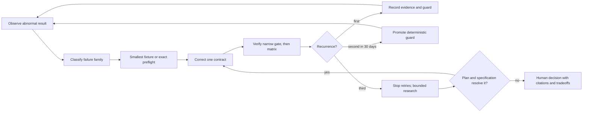
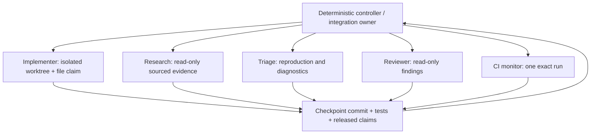

# Engineering system

This page defines how Symphony turns implementation failures into durable guards, partitions agent
work, manages context, and evolves coding/documentation gates. It is operational guidance, not part
of OpenAI Symphony Draft v1.

## Current posture

- GCC 16.1 defines executable semantics; Bloomberg clang-p2996 is reflection-differential only.
- `WORKFLOW.md` deliberately keeps OpenSymphony at one concurrent worker until parallel write lanes
  are fixture-proven.
- Native collaboration may use parallel read-only research, triage, or review lanes. The root
  integration agent is the only writer unless isolated worktrees and file claims are explicit.
- Validate the complete pinned OpenSymphony feature matrix before disabling a feature. Reproduce
  upstream behavior and link the upstream issue before adding an external-supervisor containment.
- One exact GitHub Actions run has one watcher. Quiet or stale partial logs never justify a
  duplicate run.
- Four turns bound one worker session. Reported context utilization triggers earlier checkpoints
  and rollover; compaction never resets no-progress evidence.
- Fully researched, plan/spec-conformant changes may follow the guarded autonomous merge path.
  Human intervention is reserved for material ambiguity or contradiction that remains after
  source, test, upstream-report, and primary-documentation reconciliation.

## Closed learning loop



A result is learned only when the implementation log links to an executable guard, fixture,
preflight, or an explicit reason that human review is the only enforceable mechanism.

Record:

- normalized failure signature and family;
- exact repository commit, command/workflow/job/target, toolchain, and environment;
- progress fingerprint and recurrence count;
- bounded redacted diagnostic;
- deterministic, intermittent, external, or authority-blocked classification;
- correction, focused evidence, full-matrix evidence, and guard link;
- model, effort, turn, reported token/window telemetry, compaction count, and terminal reason;
- owner and deletion/re-evaluation trigger for any promoted guard.

Failure families are dependency/provider selection, build graph/include propagation,
compiler/toolchain compatibility, devcontainer lifecycle, cache/cold start, asynchronous ordering,
duplicate job/resource ownership, agent context/no-progress, authority/governance, and product
behavior.

Promotion policy:

1. First occurrence: preserve the failed evidence, correct the smallest contract, and record the
   regression guard.
2. Second occurrence in the same family within 30 days: strengthen a deterministic check, script,
   fixture, skill, or mandatory checklist and name its owner.
3. Third occurrence: disable automatic retry for that family and perform a bounded reconciliation
   of the approved plan, normative specification, current source/tests, upstream reports, and
   primary documentation. Resume autonomously only when those sources determine a plan-conformant
   correction. Otherwise route the exact unresolved ambiguity or contradiction to Human Review
   with citations, viable proposals, advantages, disadvantages, and a recommendation.

Every promoted guard needs a deletion trigger so stale ceremony does not accumulate.

## Small-task contract

A normal lane owns one externally observable behavior or infrastructure invariant, one failing
fixture/reproduction, one provider or seam, and one focused validation command. It should reach a
coherent checkpoint within the four-turn session.

Before writes, state a task capsule containing:

- the one observable contract and acceptance boundary;
- allowed and denied files, shared files requiring integration-owner serialization, and owned
  build/cache/container resources;
- the failure-first fixture or reproduction and exact focused command;
- dependency-decision status, provider/seam, checkpoint target, and stop/split conditions;
- the next atomic action and durable handoff owner.

Until the controller claim schema and atomic acceptance fixtures exist, the integration owner
records this capsule in the native task plan and OpenSymphony remains at one writable worker. This
interim planning record is not a lease and cannot authorize parallel writes.

Split work when it:

- crosses more than one subsystem boundary;
- mixes unresolved dependency selection with production integration;
- mixes compiler-image work with product behavior;
- requires several writers to the same shared file;
- needs more than one expensive compiler matrix;
- cannot express success as one changed progress fingerprint.

Preferred sequence:

```text
provider gate -> thin adapter -> product wiring -> adversarial fixture -> integrated matrix
```

## Review protocol

Every code-bearing or policy/control-document slice receives an independent normal development
review of the complete current diff. It checks specification and approved-plan conformance,
dependency-first compliance, correctness, tests, redaction, and evidence freshness. Concurrency,
persistence, security,
credentials, workspace deletion/containment, release, publication, autonomous-merge, or
policy/control-document changes also require a separate adversarial review using hostile,
malformed, race, crash, replay, and stale-evidence cases appropriate to the boundary. A low-risk
mechanical or narrative-only change may omit adversarial review only when it cannot change any of
those controls and the task capsule records why no risk trigger applies.

Both reviews return prioritized findings with file/line evidence. The integration owner records
each disposition, applies corrections, reruns affected checks, and repeats development review after
any byte change within the reviewed paths. Autonomous evidence accepts only normal and required
adversarial attestations bound to the exact final commit after all corrections; an uncommitted diff
review is never reused as merge evidence. The reviewer record includes identity, review kind,
reviewed commit, result, and role/contribution history. An independent reviewer did not design,
author or materially shape its implementation prompt, patch, disposition, or correction; receiving
a bounded review prompt does not violate independence. Unresolved findings, invalid independence,
or a stale commit blocks evidence gating. A defect that escapes implementation and is caught in
review re-enters the closed learning loop with its failure family, correction latency, promoted
guard, and deletion trigger; review is not a substitute for a deterministic guard.

## Parallel-agent contract



| Lane | Authority | Writable scope | Required handoff |
| --- | --- | --- | --- |
| Controller/integration | dispatch, leases, tracker state, job deduplication, merge order | integration branch and orchestration records | final integrated SHA and evidence |
| Implementer | one issue contract | one isolated worktree/branch and declared file allowlist | commit, tests, risks, next action |
| Research/architecture | evidence and recommendation | read-only unless separately assigned a decision record | sources, alternatives, uncertainties |
| Test/triage | reproduction and causality | preferably fixture-only | minimal reproduction and failure signature |
| Reviewer | independent findings | read-only | prioritized file/line/evidence findings |
| CI monitor | observe one exact run | none | run ID, SHA, step, bounded tail, terminal result |

Interference rules:

- one branch and worktree per writable lane;
- one writer per file;
- before writable concurrency exceeds one, every lane must hold a durable atomic claim containing
  canonical repository/worktree/branch identity, canonicalized allowed paths, shared resources,
  owner, issue/task capsule, acquisition time, expiry, and recovery state;
- root CMake/vcpkg files, workflows, lockfiles, public shared headers, generated-fixture inputs,
  architecture ledgers, and integration branches are serialized through the integration owner;
- build directories, container names, and non-atomic local caches have one owner;
- overlapping claims pause or repartition a lane;
- no lane mutates another worktree, resolves another lane's conflicts, cancels another lane's job,
  or expands its issue;
- the independent reviewer reports findings and does not silently co-author;
- lane-local green evidence does not replace final integrated checks.

Claim admission rejects canonical path intersection, alias/symlink ambiguity, duplicate
branch/worktree ownership, and shared-resource overlap. Expired or crashed claims remain quarantined
until the integration owner reconciles their Git state and resources; they are never silently
stolen. Integration follows an explicit merge order, aborts and repartitions on conflict, drains
cancelled work before releasing resources, and runs final checks on the integrated SHA.

This admission contract is design-only until a versioned storage path/schema, canonicalization
algorithm, atomic acquire/release operation, TTL/crash recovery, and hostile fixtures land. No
manual note or model output substitutes for that gate.

Start with one implementer plus one independent read-only specialist. Increase concurrency only
after file claims, cancellation, completion drain, merge serialization, and shared-resource
ownership have deterministic fixtures. Until then, keep OpenSymphony's
`agent.max_concurrent_agents` at `1`.

## Context, compaction, and model effort

The percentage rows activate only after the selected worker path supplies the distinct,
fixture-proven context-pressure telemetry named by its policy. Until then, missing or cumulative-only
telemetry pauses percentage-based supervisor continuation; observed-compaction and per-session-turn
rollover remain active.

| Reported context use | Action |
| --- | --- |
| below 50% | normal bounded work |
| 50% | checkpoint after the next coherent change; add no scope |
| 60% | prepare durable handoff and finish only the active atomic slice |
| 65% or configured rollover | start no continuation; resume from the checkpoint in a fresh process/thread |
| any observed compaction | finish the active turn, checkpoint, and use a fresh process/thread |
| telemetry absent | pause; never estimate or authorize another worker run |

Fork only to create a genuinely independent lane with a small input/output contract or the
supervisor's short-lived recovery checkpoint. A recovery fork is durable evidence, not a session to
continue working in; resume from reconciled durable state in a fresh session. Do not continue a
bloated or compacted session. Neither compaction, forking, nor process exit resets
retry/no-progress counters.

The default implementer remains Sol/high. Use Sol/xhigh for cross-subsystem architecture, bounded
primary-source research, or the fresh session after one typed product/test/compiler no-progress
result. Use one Sol/max recovery session only after the same eligible signature repeats, then stop
automatic retries and perform the bounded research reconciliation if it repeats again. Credential,
authority, missing-telemetry, external-service, and resource failures pause or use deterministic
handling rather than higher model effort. Require Human Review only when material ambiguity or a
plan/specification conflict remains. Terra/medium is appropriate for contained reproduction/CI
triage and can move to high when causality remains ambiguous. The deterministic controller uses no
model.

Monitor model/effort effectiveness through progress fingerprints, recurrence signatures, terminal
reasons, context/compaction telemetry, correction latency, and defects caught in independent
review—not by process exit or subjective fluency. Re-probe supported model/effort pairs whenever
the pinned Codex CLI or image changes.

Track the redacted review-escape family, recurrence, correction latency, deterministic-guard hit
rate, false-positive rate, and deletion-review outcome. Self-learning means promoting reproducible
guards, skills, and checklist rules within approved scope; it never authorizes policy expansion,
issue-content copying, or hidden model-driven mutation.

### Durable checkpoint fields

Persist these fields at each coherent checkpoint:

```text
schema_version, checkpoint_id, issue_id, repository_url,
base_sha, head_sha, branch, worktree, role, model, effort, turn_number,
context_window, last_input_tokens, cumulative_input_tokens, cumulative_output_tokens,
cumulative_cached_tokens, context_utilization_percent, compaction_count,
scope_and_acceptance, progress_fingerprint,
failure_signature, failure_family, consecutive_failure_count,
files_claimed, files_touched, decisions_and_sources, tests_and_results,
active_jobs { provider, id, sha, owner, state },
authority_constraints, redacted_diagnostics, unresolved_risks,
next_atomic_action, next_owner, review_state, created_at
```

The event store is the future machine-readable authority. A code-bearing checkpoint also needs an
exact commit. Before workspace cleanup, the controller must verify that the handoff was persisted.

## Local artifact lifecycle

Delete project-specific local images, stopped containers, volumes, networks, generated acceptance
artifacts, and build outputs once no current validation, recovery, or reproducibility contract
needs them. Resolve the exact immutable ID or repository-owned label first, verify that no active
run or durable handoff references it, retain only the bounded evidence needed to reproduce the
result, and then remove that exact object. Never use a broad prune as task cleanup, delete a shared
base/toolchain image or cache, or remove another lane's resource. Unclear ownership or retention
requirements pause cleanup for research.

## Coding, analysis, and documentation roadmap

The repository enforces C++26/no extensions, GCC warnings as errors, compile-database export, debug
tests, ASan+UBSan, separate TSan, and CMake-owned public-header self-containment. Phase 1 now pins a
separate stock LLVM 22.1.8 analysis devcontainer, an exact formatter gate, and a narrow report-only
tidy baseline. The zero-noise tidy promotion, a public-API extractor, a documentation site, and a
rendered-diagram gate remain open.

Dependency-first decisions for these build utilities must be recorded before integration. Stock
Clang analysis is a third toolchain: it does not define release behavior and must not reuse the
experimental clang-p2996 fork.

### Phase 1: reproducible source quality

- [x] Pin one stock LLVM analysis image and version.
- [x] Commit `.clang-format`; run exact `clang-format --dry-run --Werror` over tracked C/C++ sources.
- [x] Commit a narrow `.clang-tidy`; verify its configuration, use a reflection-disabled compile
  database, exclude third-party headers, and start with analyzer, bug-prone, performance,
  portability, selected concurrency/CERT, and include-cleaner checks.
- [ ] Prove the added `string_view`, optional, condition-variable, coroutine/lock, exception, and
  performance checks have a zero-warning project baseline in the exact LLVM 22.1.8 Linux image;
  promote only that exact zero-noise subset through a source-controlled `WarningsAsErrors`
  allowlist.
- [ ] Pass the fixture-only `clang-rtsan` workflow in the exact LLVM 22.1.8 Linux image before
  considering any product `nonblocking` annotation.
- Run IWYU report-only with a compatible pinned LLVM build; promote only stable project-header
  findings and never auto-rewrite includes in CI.
- [x] Add self-contained compilation fixtures for every public header and compile-time/static-assert
  contract fixtures.
- [x] Build and test the existing `gcc-release` preset because optimized diagnostics differ.

Pilot additional GCC 16.1 warnings individually against project code:

```text
-Wconversion -Wsign-conversion -Wshadow=compatible-local -Wformat=2
-Wnull-dereference -Wduplicated-cond -Wduplicated-branches
-Wlogical-op -Wuseless-cast
```

Promote a flag to fatal only after its project-owned baseline is zero. Keep system/dependency
headers isolated. Separately evaluate `-fhardened -Whardened` for Linux release executables, verify
the resulting ELF protections, and benchmark it; do not apply it to sanitizer or differential jobs.

### Phase 2: documentation and diagrams

- Keep narrative Markdown as the source of truth.
- Use Mermaid source for curated runtime, workflow, sequence, and state diagrams that cannot be
  derived reliably from code.
- Use pinned Graphviz for deterministic CMake target/dependency graphs and API relationships; label
  build topology as such rather than presenting it as runtime truth.
- Pilot MrDocs against a reflection-disabled compilation database and public headers. Require a
  pinned released binary/container and reject any setup that bootstraps floating LLVM/source trees.
  If its Clang parser cannot consume the project boundary, compare a pinned Doxygen public-header
  extraction instead.
- Start missing-documentation checks with a counted baseline that may only decrease; make malformed
  references fatal immediately and make undocumented public symbols fatal only after the existing
  debt is removed.
- Build existing Markdown plus generated API output with pinned MkDocs/Material and
  `mkdocs build --strict`. Generated output is disposable and never hand-edited.
- Keep external-link checking scheduled/nonblocking for pull requests so network instability cannot
  mask source correctness.

GitHub Pages is the preferred eventual host because it stays with the repository, but site/image
publication requires a separate owner-approved workflow. Read the Docs remains a versioned-preview
alternative if its external service and webhook ownership become worthwhile.

## Near-term C++26 deletion tests

1. [x] Replace the handwritten observability JSON encoder with the already-selected Glaze DTO codec.
2. [x] Make `symphony_meta` field descriptors compile-time rather than allocating
   `std::vector<std::string>` at runtime.
3. [x] Cover Codex startup and workflow decode DTO structure/name/type contracts at compile time
   under authoritative GCC 16.1. Keep the clang-p2996 differential target dependency-free until the
   pinned fork can compile Glaze.
4. [ ] Generate exhaustive enum-name tables through the selected reflection seam rather than adding a
   second enum-reflection library.
5. [ ] Evaluate `stdexec` structured completion only as a deletion test for existing detached-work and
   stop bookkeeping; preserve keyed cancellation and exact GCC 16.1 evidence.

Reflection must never become the sole redaction boundary. Secret classification is semantic, and
experimental annotation behavior differs between the pinned compilers.
