# OpenSymphony external supervisor

OpenSymphony v2.10.0 remains a pinned, stock development orchestrator. A separate
local-only C++26 `opensymphony-supervisor` process supplies the execution budgets,
progress decisions, context checkpoints, and merge evidence that the pinned
release does not implement. It is a guard around OpenSymphony, not a replacement
Symphony controller and not part of the deployed standalone service.

The supervisor is the direct parent of `opensymphony run` inside the contained
worker-host image. It receives no Docker socket. OpenSymphony and its Codex child
receive no GitHub merge credential. A separate publisher verifies the
supervisor's digest-bound evidence before it performs repository actions.

## Implementation and validation order

The pinned stock OpenSymphony release is validated before any feature is
disabled or replaced. The complete feature matrix must record executable
evidence for supported behavior and explicit evidence for unsupported,
misleading, or incomplete upstream behavior. A feature is not skipped merely
because the initial Codex route does not need it.

Upstream behavior is handled upstream-first: reproduce the smallest case
against the pinned release, search existing upstream reports, and file or update
an upstream issue with bounded redacted evidence before designing a local
containment. The external supervisor may enforce repository-owned safety and
evidence policy that upstream does not provide, but it does not patch, fork, or
silently redefine OpenSymphony. Complete the supervisor guards and their linked
upstream issues before widening autonomous worker or merge authority.

## Accepted operating policy

| Policy | Initial value |
| --- | --- |
| Active issues | One |
| Per-session turn cap | Four completed model-backed turns; resets only after durable fresh-session reconciliation |
| Issue-wide worker-session budget | Four accepted model-backed worker sessions; never resets |
| Wall-clock budget | 90 minutes from the first model-backed run |
| No-progress budget | Two consecutive post-baseline runs |
| Repeated-failure budget | Two matching redacted signatures without changed diff/check evidence |
| Context metric gate | Distinct optional `tokenUsage.last.inputTokens` decoding and pure reducer fixtures pass; external process wiring remains disarmed |
| Context checkpoint | At 50% of decoded last-turn input tokens over the reported positive model context window |
| Context handoff | At 60%, finish only the active atomic slice and prepare durable handoff |
| Context rollover | At 65%, authorize no continuation and resume from durable state in a fresh session |
| Missing or inconsistent telemetry | Pause; never estimate |
| Checkpoint, cancellation, or fresh-session reconciliation failure | Pause and preserve the original thread |
| Pause tracker state | `Backlog`, which is outside the configured active-state set |
| Operational concurrency | One until the complete isolated-concurrency fixture passes |

Cached input is not added to the last-turn input count again. Cumulative token totals are cost
evidence, not the target context-utilization metric. The adapter separately decodes optional
`tokenUsage.last.inputTokens`; the pure reducer uses only that value and pauses when it or the
positive context window is missing. The external supervisor process still has no accepted
telemetry/checkpoint wiring, so this operational percentage policy remains disarmed. The issue-wide
session counter increments only after the launched child and gateway identities are accepted. The
fourth session may finish; a fifth may not launch. Every accepted model-backed worker session
consumes that budget even when it is later cancelled for a checkpoint. Fresh-session reconciliation
resets only `turns_in_session`; restarts, compaction, forks, and process failure never reset
issue-wide counters or deadlines.

## State machine

```mermaid
stateDiagram-v2
  [*] --> Disarmed
  Disarmed --> Preflight: operator arms one governed issue
  Preflight --> Launching: policy and persisted state agree
  Preflight --> Exhausted: four worker sessions already accepted
  Preflight --> Quarantined: missing or contradictory evidence
  Launching --> ObservingRun: identities agree; session counter increments
  ObservingRun --> ProgressCheckpoint: 50 percent after coherent change
  ProgressCheckpoint --> ObservingRun: checkpoint persists below handoff
  ProgressCheckpoint --> PausedNeedsReview: checkpoint persistence or verification fails
  ObservingRun --> HandoffPending: 60 percent, turn cap, or observed compaction
  HandoffPending --> CheckpointVerifying: active atomic slice and turn complete
  ObservingRun --> CheckpointVerifying: context reaches 65 percent between turns
  CheckpointVerifying --> Cancelling: exact checkpoint commit and clean scope verified
  CheckpointVerifying --> Quarantined: dirty, untracked, stale, or out-of-scope state
  ObservingRun --> Evaluating: run completes
  ObservingRun --> Exhausted: 90-minute deadline
  ObservingRun --> Quarantined: event gap or identity conflict
  Cancelling --> Reaping: child stops within grace period
  Cancelling --> Quarantined: cancellation or reap fails
  Reaping --> FreshSessionReconciling: verified handoff persists
  Reaping --> PausedNeedsReview: handoff persistence fails
  FreshSessionReconciling --> Evaluating: Git, tracker, counters, and evidence agree
  FreshSessionReconciling --> PausedNeedsReview: restored state disagrees
  Evaluating --> ContinueAuthorized: objective evidence changed
  Evaluating --> Exhausted: four sessions complete and issue remains incomplete
  Evaluating --> PausedNeedsReview: second no-progress or repeated failure
  ContinueAuthorized --> Launching
  Evaluating --> NormalReview: issue work is complete
  NormalReview --> AdversarialReview: risk trigger applies
  NormalReview --> EvidenceGating: exact final head clean and no adversarial trigger
  NormalReview --> Evaluating: correction changes reviewed fingerprint
  NormalReview --> PausedNeedsReview: stale review or unresolved finding
  AdversarialReview --> EvidenceGating: exact final head clean and reruns pass
  AdversarialReview --> Evaluating: correction changes reviewed fingerprint
  AdversarialReview --> PausedNeedsReview: unresolved finding or invalid reviewer
  EvidenceGating --> MergeReady: every digest-bound gate passes
  EvidenceGating --> PausedNeedsReview: gate fails or scope is ambiguous
  Exhausted --> PausedNeedsReview
  Quarantined --> PausedNeedsReview
  PausedNeedsReview --> Preflight: bounded reconciliation resolves evidence
  MergeReady --> [*]
```

`PausedNeedsReview` is a fail-closed machine state, not an automatic request for
human approval. The controller first dispatches the bounded research and
reconciliation allowed by the issue manifest; it asks a person only when that
work leaves a material ambiguity, contradiction, or missing authority.

The supervisor persists the issue identity, absolute deadline, run counters,
context observations, failure signatures, progress fingerprints, child
identifiers, gateway cursor, checkpoints, and every policy transition in its
own SQLite journal before it launches or resumes work. Gateway history is
bounded and in-memory, so restart reconciliation fails closed when the durable
journal and current gateway/manifests cannot be proven consistent.

## Objective progress

A run makes objective progress only when at least one approved artifact changes:

- repository HEAD or an allowed-path content fingerprint;
- a required command produces a new exit status and artifact digest;
- an approved plan item advances with attributable evidence;
- an allowed PR or tracker state advances.

Tokens, summaries, timestamps, run identifiers, repeated commands, process
success, and unsupported claims of completion are not progress.

OpenSymphony's validation endpoint is advisory because it does not carry the
required command/evidence records. The supervisor reads actual repository,
test-artifact, and CI evidence instead.

## Context checkpoint

At 50% the supervisor checkpoints after the next coherent change and accepts no
new scope. At 60% it finishes only the active atomic slice and prepares durable
handoff. At the 65% boundary it:

1. persists the observation after the current turn completes and denies another continuation;
2. requires that completed worker result to identify its already-created checkpoint commit and
   task capsule;
3. verifies within a bounded grace period that every allowed change is committed at that
   checkpoint; dirty, untracked, or
   out-of-scope state enters quarantine and is never synthesized into a commit by the supervisor;
4. stops and reaps OpenSymphony, then persists the verified commit-bound handoff;
5. preserves the original thread as read-only recovery evidence without requiring compaction;
6. starts a fresh contained Codex process and thread against the same isolated authentication and
   issue workspace;
7. restores only from the durable checkpoint and reconciles Git, tracker, counters, and evidence
   before authorizing another run.

An optional short-lived recovery fork may preserve the last completed-turn evidence, but no work
continues in that fork and it is never required to compact the original. An already observed Codex
compaction is itself a fail-safe rollover signal. Missing `modelContextWindow`, an event gap, a
failed checkpoint/fresh-session handoff, or disagreement about the last completed turn pauses the
issue.

## Autonomous merge contract

Autonomous merge is permitted only when a tracked plan-policy manifest already
authorizes it. The manifest contains:

- issue and repository identities;
- normative specification and approved-plan digests;
- allowed paths;
- exact required commands, presets, compiler/container matrix, and review gates;
- task capsule, file/resource claims, risk triggers, reviewer independence requirements, reviewed
  SHA, review kinds, findings digest, dispositions, and required reruns;
- expected publication target and merge strategy;
- explicit autonomous-merge authorization;
- excluded change classes.

The global supervisor policy is tracked in this repository. A per-issue manifest
may be derived without human intervention when it is a strict subset of the
approved standalone implementation plan and governing specification. Changing
the global policy or expanding an issue beyond those sources requires human
review.

This authority is currently disarmed. No derived manifest or autonomous merge is valid until the
tracked global policy/schema, verifier fixtures, required checks, selected publisher app, fetched
ruleset reconciliation, merge-queue fixtures, and explicit protected-base enable flag all exist and
pass. Descriptive future policy in this document grants no merge or credential authority.

The normative specification and fully researched approved plan are the primary
decision inputs. A plan-conformant change with complete, fresh evidence proceeds
through the guarded autonomous path without routine human approval. Research is
a prerequisite to escalation, not itself a reason to escalate: first reconcile
the current specification, approved plan, source, tests, upstream reports, and
primary documentation. Pause for a person only when material ambiguity or a
contradiction remains after that reconciliation.

The supervisor emits a commit-bound evidence envelope. A separate publisher
checks the envelope signature/digest, base and head SHAs, branch freshness,
required CI, unresolved reviews, publication scan, and branch rules before
enabling auto-merge. It never force-pushes, rebases, bypasses a rule, or merges a
stale head.

Human intervention is required only after research when:

- governing specifications, approved plans, or cited primary sources conflict;
- the requested diff exceeds its allowed paths or acceptance commands;
- required telemetry/evidence is missing or contradictory;
- a security, credential, deployment, publication, workflow-permission, or
  dependency exception is not explicitly covered by the approved manifest;
- a required provider/toolchain cannot satisfy the recorded contract.

That handoff must identify the exact unresolved question, explain the
contradiction or missing authority, cite the governing and primary sources, and
present viable proposals with their advantages, disadvantages, and a
recommended next decision. It must not mutate the disputed scope while awaiting
the decision.

The existing overlay-updater policy explicitly prohibits auto-merge.
Dependency-pin updater PRs therefore remain human-reviewed until that governing
decision is deliberately revised. Ordinary dependency use inside an already
approved immutable graph is not excluded.

The tracked global policy and schema will live under
`.github/autonomy/policy-v1.json` and `.github/autonomy/policy.schema.json`.
Derived issue policies live at
`.symphony/plans/<issue-identifier>.merge-policy.json`. The publisher reads the
global policy from the protected base commit and accepts a head policy only
after proving that allowed paths shrink, denied/excluded sets and required
evidence only grow, expiry and size caps only tighten, and immutable repository,
source, plan, merge-method, and publisher-app identities are unchanged. Unknown
fields and ambiguous glob containment pause.

The required-check rollout is deliberately staged:

1. land an unconditional `CI / required` aggregate on `pull_request` and
   `merge_group`, plus policy/schema/verifier fixtures;
2. install a repository-selected GitHub App whose only write capability is the
   app-owned `autonomy-policy / merge-ready` check and merge authority;
3. seed both exact check contexts, then create a disabled no-bypass `main`
   ruleset and compare its fetched representation with the tracked policy;
4. activate pull-request, squash-only, resolved-thread, deletion,
   non-fast-forward, strict-CI, and app-check rules and prove blocking/allowed
   fixture cases;
5. add a one-PR merge queue only after both Actions and the publisher revalidate
   the synthetic `merge_group` head.

The worker and supervisor never receive the GitHub App key or installation
token. The Mac-local publisher mints a repository-scoped installation token for
one decision, recomputes base/head/check/review/ruleset facts, posts a
commit-bound evidence digest through the Checks API, and enables auto-merge
against the expected head OID. It never uses admin bypass, direct merge, rebase,
force-push, branch update, Actions write, workflow write, packages, deployment,
secrets, or repository-administration permission.

Merge authorization does not imply deployment, package publication, image
publication, or broader tracker mutation. Each remains a separate explicit
authority boundary.

## Model and effort

The supervisor itself is deterministic and uses no model.

- Normal implementation: `gpt-5.6-sol` / `high`.
- Cross-subsystem design or first typed product/test/compiler no-progress result: Sol / `xhigh`.
- Second matching eligible signature: one short Sol / `max` diagnostic session.
- Another matching failure or missing evidence: pause.
- Focused deterministic reproduction may use Terra / `medium`, promoted to
  `high` only when causality remains ambiguous.

Credential, authority, missing-telemetry, external-service, and resource failures are not
model-effort escalation triggers; they pause or use deterministic recovery. De-escalation requires
a changed progress fingerprint and fresh green review evidence.

Effort is selected through preapproved, read-only Codex configuration overlays
between worker runs. OpenSymphony's ignored `codex:` map is not treated as an
effective control.

## Required fixture coverage

- transition-table boundaries and virtual-clock deadlines;
- fourth-session completion, fifth-session launch rejection, and 90-minute persistence across
  crashes/restarts;
- duplicate, missing, and out-of-order events;
- context values immediately below/at 50%, 60%, and 65%, threshold-crossing turns, null/stale
  windows, and compaction events;
- checkpoint persistence, fresh-session handoff, optional recovery-fork, and cancellation failures;
- automatic-continuation races;
- objective-progress discrimination and repeated failure normalization;
- stale-SHA review, coauthor-as-reviewer, unresolved finding, and bypassed-adversarial-trigger cases;
- atomic file/resource claims, canonical path overlap, expiry/crash recovery, conflict
  repartitioning, cancellation drain, and final integrated evidence;
- malformed or hostile manifests and structured-event redaction;
- merge-envelope replay, tampering, stale heads, and disallowed paths;
- fake Linear pause transitions and conflicts;
- fake GitHub CI/review/auto-merge behavior;
- disposable-container end-to-end operation with fake Linear, Codex, and
  GitHub services.

Upstream gaps are tracked in
[OpenSymphony #222](https://github.com/kumanday/OpenSymphony/issues/222),
[#223](https://github.com/kumanday/OpenSymphony/issues/223), and
[#224](https://github.com/kumanday/OpenSymphony/issues/224). The fixed gateway
timeout is recorded in
[#225](https://github.com/kumanday/OpenSymphony/issues/225), and the
missing-`gh` memory-test diagnostic gap is tracked in
[#226](https://github.com/kumanday/OpenSymphony/issues/226).
