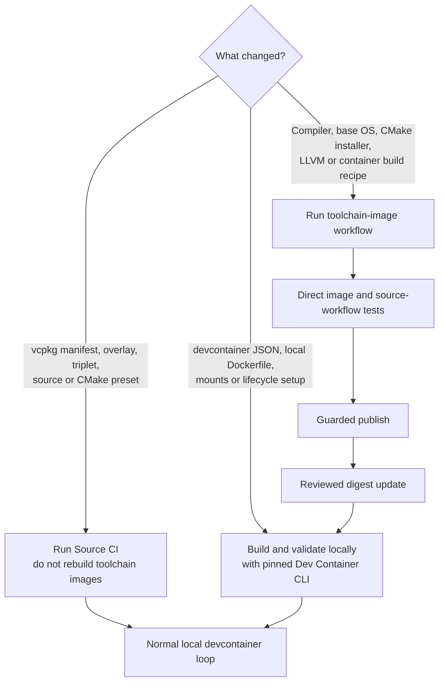
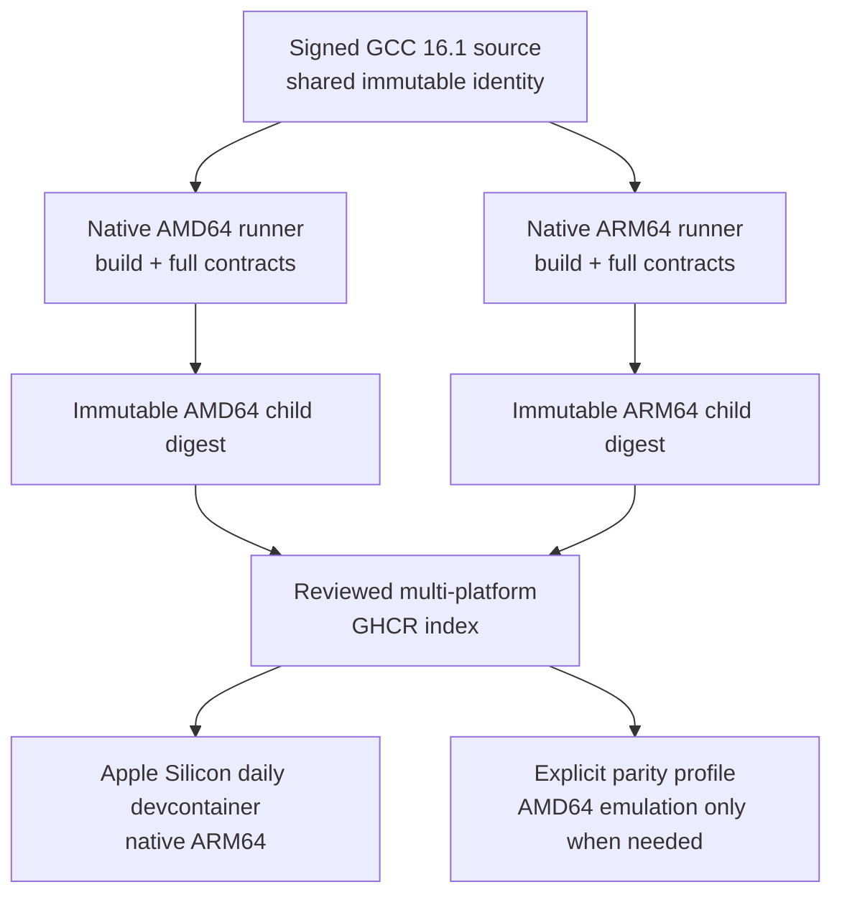
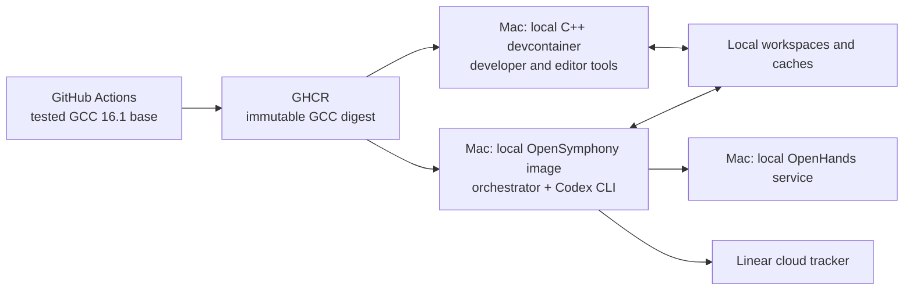

# Toolchain images and local development containers

This repository separates stable compiler toolchains from the day-to-day development environment.
The end state builds and tests immutable Linux AMD64 and ARM64 **toolchain base images** on native
GitHub runners. The current workflow selects one architecture per dispatch, with ARM64 restricted
to GCC 16.1 until that first native phase passes. A developer's
version-pinned Dev Container CLI then builds and starts a thin local development container from one of
those bases, applies the checked-in mounts and environment, and runs the repository lifecycle
setup.

This boundary follows the Development Container specification's distinct image-creation,
container-creation, and lifecycle phases. Image creation may pull or build an image; lifecycle
commands run after the workspace is mounted. The reference CLI exposes those phases through
`build`, `up`, `run-user-commands`, and `exec`.

Primary sources:

- [Development Container lifecycle specification](https://github.com/devcontainers/spec/blob/main/docs/specs/devcontainer-reference.md#lifecycle)
- [Dev Container CLI commands and lockfiles](https://github.com/devcontainers/cli#dev-container-cli)
- [Published `@devcontainers/cli` package](https://www.npmjs.com/package/@devcontainers/cli)
- [Official prebuild guidance](https://containers.dev/guide/prebuild)
- [`devcontainers/ci` supported prebuild and run modes](https://github.com/devcontainers/ci#dev-container-build-and-run-devcontainersci)
- [GitHub's Docker image publication workflow](https://docs.github.com/en/actions/tutorials/publish-packages/publish-docker-images)
- [Docker GitHub Actions cache backend](https://docs.docker.com/build/cache/backends/gha/)
- [Docker cache optimization](https://docs.docker.com/build/cache/optimize/)
- [Docker cache-only exporter](https://docs.docker.com/build/exporters/#cache-only-export)
- [`reproducible-containers/buildkit-cache-dance`](https://github.com/reproducible-containers/buildkit-cache-dance/tree/v3.4.0)
- [`cppalliance/local-ci-test-system`](https://github.com/cppalliance/local-ci-test-system)

The official guidance also supports publishing a fully prebuilt devcontainer from CI. That is a
valid alternative, but it is not this repository's selected boundary. Compiler construction is
rare and expensive; repository dependencies, editor integration, cache mounts, and developer
lifecycle setup change more often and stay local. The C++ Alliance source is a design proposal
rather than a finished implementation; its useful lesson here is the separation of stable
compiler images from mutable ccache, CMake, and dependency caches.

## Artifact boundary

```mermaid
flowchart LR
    subgraph CI["GitHub Actions — stable toolchain supply"]
        P["Immutable pins<br/>base OS, GCC 16.1,<br/>clang-p2996, LLVM 22.1.8,<br/>CMake 4.4"]
        B["Native Buildx dispatch<br/>one lineage × one architecture"]
        V["Ephemeral validation descendant<br/>never published"]
        C["Build-time contracts<br/>version, C++26/reflection,<br/>runtime linkage + source workflows"]
        K["Cache-only exporter<br/>no Docker Engine import"]
        G["Planned guarded publication<br/>candidate child digests,<br/>exact validation + multi-arch index"]
        P --> B --> V --> C --> K --> G
    end

    subgraph Local["Mac — daily development environment"]
        L["Checked-in immutable<br/>base-image digest"]
        D["Dev Container CLI<br/>build / up"]
        E["Thin local derived image<br/>metadata and local configuration"]
        M["Create container<br/>workspace + cache volumes"]
        S["postCreateCommand<br/>pinned vcpkg graph"]
        X["devcontainer exec<br/>CMake / Ninja / CTest"]
        L --> D --> E --> M --> S --> X
    end

    G -. "reviewed digest update" .-> L
```



The planned published bases contain only stable, reusable CI tools:

| Lineage | Published base contents |
| --- | --- |
| GCC | Linux build prerequisites, architecture-matched CMake 4.4.0, Ninja, ccache, and native GCC 16.1 with its matching libstdc++ runtime |
| clang-p2996 | The common build prerequisites plus native Bloomberg clang-p2996 at `7220baff` and its C++26 reflection runtime; AMD64 remains required while ARM64 earns differential parity |
| Analysis | The GCC runtime plus the architecture-matched official LLVM 22.1.8 `clang-format`, `clang-tidy`, static analyzer, and LLD tools |

The analysis CMake preset explicitly chainloads `cmake/toolchains/clang-analysis.cmake` through
vcpkg's outer toolchain. Defining that chainload only inside the overlay triplet would configure
dependency builds but leave project compile commands on the container's system libstdc++. The
validation descendant therefore requires the generated compilation database to carry
the pinned Clang compiler, exactly `-std=c++26`, and `--gcc-toolchain=/opt/gcc-16.1` in every
analyzed project source command, and independently proves `_GLIBCXX_RELEASE == 16` before running
clang-tidy over that complete database. Analysis configuration starts from a fresh CMake cache so a
mounted build tree cannot retain pre-fix initialization flags. Exact formatting runs before
dependency installation. Warning diagnostics remain report-only at this phase; behavioral fixtures
reject nested or runner-supplied configuration and warning promotion, while compiler, configuration,
and toolchain-selection errors remain fatal.

The sibling `clang-rtsan` preset enables Clang 22.1.8 Function Effect Analysis and compiler-rt
RealtimeSanitizer only for explicit provider fixtures. Configure first proves the compiler-rt
interface and runtime by compiling and linking with `-fsanitize=realtime`; the fixture target makes
`-Wfunction-effects` and `-Wperf-constraint-implies-noexcept` fatal. CTest then requires one safe
`nonblocking` call to pass and requires allocation and explicitly blocking controls to emit their
exact RTSan report classes. The sanitizer options target is not linked to product targets. GCC 16.1
continues to define executable semantics, and no product function is called real-time-safe until it
has a documented deadline, preallocation/lifetime contract, nonblocking call graph, and benchmark.

They do not contain the source tree, a configured build tree, the repository's installed vcpkg
graph, editor settings, named local volumes, or a Dev Container lifecycle result.

The local development container owns:

- the exact published base digest;
- compiler environment variables and explicit native architecture selection;
- persistent architecture- and compiler-specific ccache and ABI-keyed vcpkg archive volumes;
- the bind-mounted source/build tree;
- `postCreateCommand` dependency bootstrap;
- locked mise lint-tool installation plus persistent mise/pre-commit caches;
- pre-commit and pre-push hook installation;
- editor customizations and other developer-only settings.

## Publication workflow

```mermaid
sequenceDiagram
    participant O as Operator
    participant A as GitHub Actions
    participant B as Buildx
    participant V as Validation descendant
    participant R as GHCR
    participant P as Reviewable digest pin

    O->>A: Dispatch the guarded three-lineage matrix
    A->>B: Select one pinned lineage and native architecture phase
    B->>V: Build a descendant of each publishable base
    V->>V: Verify compiler, CMake, C++26/reflection, and runtime
    V->>V: Bind the checkout and run required CMake workflows
    V-->>B: Cache-only result; do not import into Docker Engine
    alt planned ceremony after every prerequisite contract is green
        B->>R: Push architecture-qualified candidate
        R-->>A: Return candidate child digest
        A->>V: Validate the candidate by exact digest
        A->>R: Assemble the index from validated child digests
        R-->>A: Return index and child manifest digests
        A-->>P: Record digest for a separate reviewed update
    else candidate validation or promotion prerequisite fails
        A-->>O: Leave candidate quarantined; fail without index or accepted-tag promotion
    end
```

Each architecture is built and tested on a native GitHub runner; QEMU is not a compiler-building
strategy. Validation descendants add only build-time checks and are never tagged or published.
`type=cacheonly` keeps their result in BuildKit and avoids duplicating the multi-gigabyte toolchain
inside Docker Engine. BuildKit cache mounts are not exported by the normal GitHub Actions cache
backend. The matrix therefore bridges only the lineage/architecture-scoped 750 MB ccache mount
through pinned `buildkit-cache-dance` and `actions/cache`; vcpkg roots, installed trees, archives,
and build trees remain local to one builder. Cross-run compiler-cache reuse remains provisional
until a two-runner sentinel and nonzero ccache-hit fixture pass.

Every qualification job now completes a stable-base solve and attempts its cache export before
binding source or running validation. This prevents a later source failure from suppressing that
same-job export attempt, but does not prove cross-run preservation. It is a failure-ordering
boundary, not the final supply chain:
run `30094944459` proved the preceding 11 GB LLVM/GCC GHA result was not reusable and then failed
while downloading GCC again. GitHub's default 10 GB cache allowance makes that combined result
subject to eviction and cache thrashing. Routine validation therefore must consume reviewed GHCR
digests; it must not reconstruct compilers or depend on compiler-source mirrors.

The obsolete publication job was removed because its older cache scopes and local image-loading
ceremony could not identify the validated result. Its replacement must push one
architecture-qualified candidate, capture the returned child digest, validate that exact digest,
and promote only those validated AMD64 and ARM64 children into the reviewed index without
rebuilding. Publication never updates a local devcontainer automatically. A separate reviewed
commit records the resolved manifest and wires the thin local Dockerfiles to it, so a developer
cannot silently move through a mutable tag. During migration, the existing local profiles remain
untrusted inputs until that digest-update commit lands.

Exact-digest validation necessarily happens after the candidate is uploaded. A failed candidate
therefore remains quarantined under its unique source-SHA-and-architecture identity for forensic
evidence; it is never added to an accepted tag or multi-platform index and is never a devcontainer
input. No workflow automatically deletes candidates. A later cleanup may remove only unpromoted,
unreferenced candidates after an explicit package-reference and age audit.

Native qualification is intentionally phased before the end-state fan-out above is enabled. One
typed dispatch selects exactly one architecture, defaulting to AMD64. The first ARM64 dispatch is
restricted to GCC 16.1 and keeps publication disabled; it must preserve the reflection smoke and
all Debug, Release, ASan/UBSan, and TSan workflows while measuring the hosted ARM runner's 14 GB
disk envelope. After that exact commit passes on both native architectures, clang-p2996 and LLVM
analysis can adopt the selector. Only six green lineage/architecture cells permit a later
two-child-index publication ceremony.

The cache-only redesign changes the immediate evidence order. First require Source CI, then run
`llvm-analysis` on AMD64 to reproduce the exact former image-import failure boundary without a local
load. Next run GCC 16.1 on AMD64 as the known-good authoritative baseline, followed by GCC 16.1 on
native ARM64. Run clang-p2996 on AMD64 after those gates. Every dispatch keeps
`publish_images=false`; no ARM or publication step may skip ahead because a different lineage was
green under the removed local-load workflow.

## Local create and daily loop


`devcontainer up` reuses an existing environment when its configuration is unchanged. The wrapper
rejects a CLI version other than the one in `.devcontainer/devcontainer-cli.version`; after the
base-digest wiring commit it also reports the selected base digest and profile before execution.
Apple Silicon selects the ARM64 child from the reviewed multi-platform index. An explicit AMD64
profile remains available for parity reproduction, but it is not the daily compiler loop. The Mac
host never configures or compiles the C++ project directly.

The three checked-in profiles still reference migration-only mutable `:edge` tags. They are not the
target invariant and may be unavailable until base publication is authorized. The reviewed
digest-wiring commit must replace every tag with an immutable multi-platform manifest before these
profiles are treated as operational evidence.

## Change routing



The expensive image workflow must not run merely because application source, documentation, vcpkg
metadata, or the local devcontainer configuration changed. Conversely, Source CI is not evidence
that a new compiler image is publishable.

## Cache policy

- Buildx uses a distinct GitHub Actions cache scope per toolchain lineage, architecture, and policy
  version.
  `mode=min` remains required because this repository already demonstrated that exporting complete
  intermediate compiler graphs can exhaust hosted-runner disk.
- Source CI keeps bounded `actions/cache` entries for vcpkg archives and ccache. It does not persist
  configured CI build trees.
- Local Docker retains immutable base layers. Named volumes retain architecture/compiler-specific
  ccache and vcpkg binary archives; the workspace retains architecture-suffixed CMake/Ninja build
  trees.
- ccache lineages include compiler identity and architecture. Linux AMD64 and Linux ARM64 results
  are never shared.

## Native ARM64 rollout

GCC 16.1 supports AArch64 and exposes the same C++26 reflection switch, but the reflection patch's
published bootstrap evidence was x86-64. ARM64 therefore starts as a candidate and becomes the
Apple Silicon default only after the exact Debug, Release, sanitizer, dependency, stdexec, and
reflection workflows pass. AMD64 remains the executable-semantics parity baseline during rollout.



The architecture map also selects Kitware's signed CMake 4.4.0 archive, LLVM's official 22.1.8
archive and attestation, the LLVM target backend, runtime-linkage checks, and vcpkg triplet.
`-march=native`, architecture-floating caches, and cross-architecture configured build trees are
prohibited. The clang-p2996 ARM64 candidate follows only after GCC ARM64 is healthy; it remains a
differential compiler on both architectures.

## OpenHands consequence

OpenSymphony is not a devcontainer dependency. The local services share a
toolchain contract without sharing container responsibilities:



The future local OpenHands worker should use the same ceremony-proven GCC base
digest when its process needs the C++ toolchain. OpenSymphony remains a separate
contained control plane, the C++ devcontainer remains interactive development
infrastructure, neither mounts the Docker socket, and Linear remains the
permitted cloud tracker.
