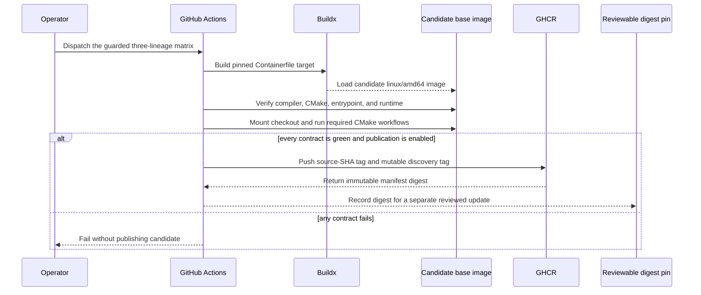
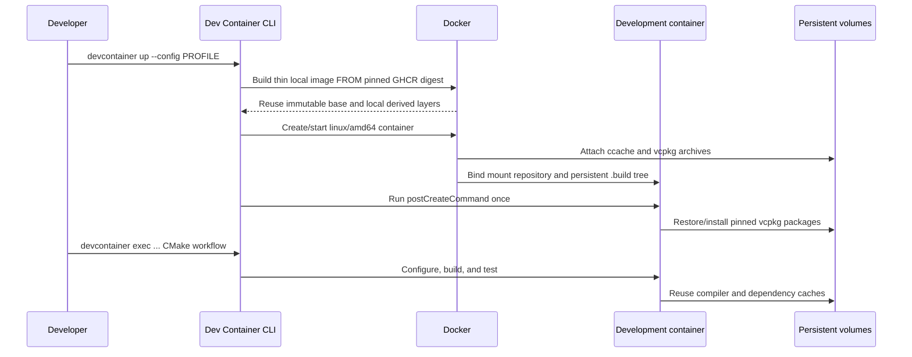
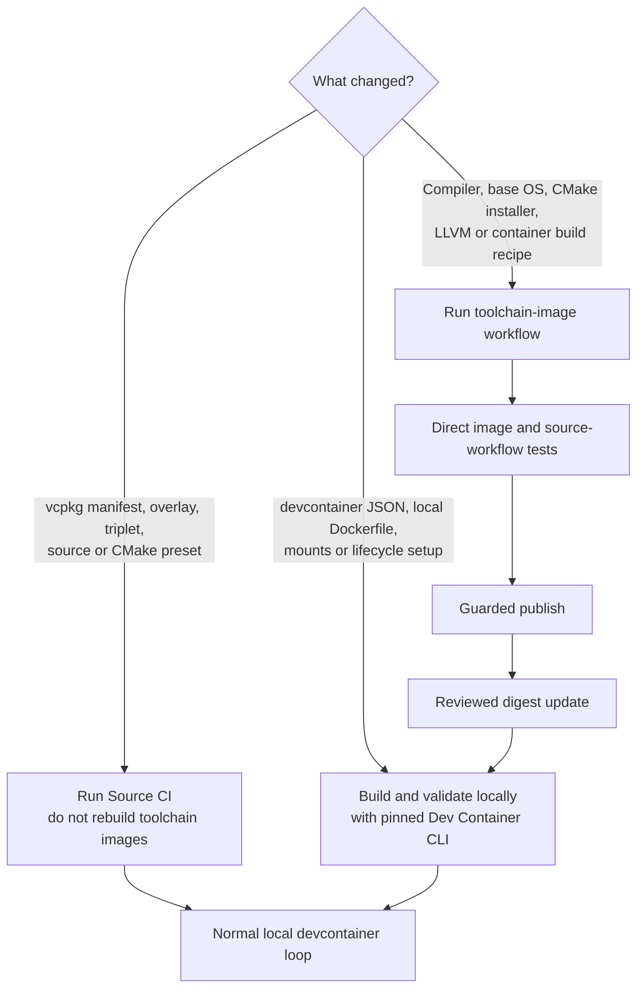

# Toolchain images and local development containers

This repository separates stable compiler toolchains from the day-to-day development environment.
GitHub Actions builds and tests immutable Linux AMD64 **toolchain base images**. A developer's
version-pinned Dev Container CLI then builds and starts a thin local development container from one of
those bases, applies the checked-in mounts and environment, and runs the repository lifecycle
setup.

This boundary follows the Development Container specification's distinct image-creation,
container-creation, and lifecycle phases. Image creation may pull or build an image; lifecycle
commands run after the workspace is mounted. The reference CLI exposes those phases through
`build`, `up`, `run-user-commands`, and `exec`.

Primary sources:

- [Development Container lifecycle specification](https://github.com/devcontainers/spec/blob/main/docs/specs/devcontainer-reference.md#lifecycle)
- [Dev Container CLI commands and lockfiles](https://github.com/devcontainers/cli#dev-container-cli)
- [Published `@devcontainers/cli` package](https://www.npmjs.com/package/@devcontainers/cli)
- [Official prebuild guidance](https://containers.dev/guide/prebuild)
- [`devcontainers/ci` supported prebuild and run modes](https://github.com/devcontainers/ci#dev-container-build-and-run-devcontainersci)
- [GitHub's Docker image publication workflow](https://docs.github.com/en/actions/tutorials/publish-packages/publish-docker-images)
- [Docker GitHub Actions cache backend](https://docs.docker.com/build/cache/backends/gha/)
- [Docker cache optimization](https://docs.docker.com/build/cache/optimize/)
- [`cppalliance/local-ci-test-system`](https://github.com/cppalliance/local-ci-test-system)

The official guidance also supports publishing a fully prebuilt devcontainer from CI. That is a
valid alternative, but it is not this repository's selected boundary. Compiler construction is
rare and expensive; repository dependencies, editor integration, cache mounts, and developer
lifecycle setup change more often and stay local. The C++ Alliance source is a design proposal
rather than a finished implementation; its useful lesson here is the separation of stable
compiler images from mutable ccache, CMake, and dependency caches.

## Artifact boundary

```mermaid
flowchart LR
    subgraph CI["GitHub Actions — stable toolchain supply"]
        P["Immutable pins<br/>base OS, GCC 16.1,<br/>clang-p2996, LLVM 22.1.8,<br/>CMake 4.4"]
        B["Docker Buildx<br/>build one base lineage"]
        C["Direct image contract<br/>version, C++26/reflection,<br/>runtime linkage"]
        T["Mount source and run<br/>the relevant CMake workflows"]
        G["Guarded GHCR publication<br/>source-SHA tag + digest"]
        P --> B --> C --> T --> G
    end

    subgraph Local["Mac — daily development environment"]
        L["Checked-in immutable<br/>base-image digest"]
        D["Dev Container CLI<br/>build / up"]
        E["Thin local derived image<br/>metadata and local configuration"]
        M["Create container<br/>workspace + cache volumes"]
        S["postCreateCommand<br/>pinned vcpkg graph"]
        X["devcontainer exec<br/>CMake / Ninja / CTest"]
        L --> D --> E --> M --> S --> X
    end

    G -. "reviewed digest update" .-> L
```

The published bases contain only stable, reusable CI tools:

| Lineage | Published base contents |
| --- | --- |
| GCC | Linux build prerequisites, CMake 4.4.0, Ninja, ccache, and GCC 16.1 with its matching libstdc++ runtime |
| clang-p2996 | The common build prerequisites plus Bloomberg clang-p2996 at `7220baff` and its C++26 reflection runtime |
| Analysis | The GCC runtime plus official LLVM 22.1.8 `clang-format`, `clang-tidy`, static analyzer, and LLD tools |

They do not contain the source tree, a configured build tree, the repository's installed vcpkg
graph, editor settings, named local volumes, or a Dev Container lifecycle result.

The local development container owns:

- the exact published base digest;
- compiler environment variables and Linux AMD64 selection;
- persistent compiler-specific ccache and ABI-keyed vcpkg archive volumes;
- the bind-mounted source/build tree;
- `postCreateCommand` dependency bootstrap;
- editor customizations and other developer-only settings.

## Publication workflow

Publication never updates the local devcontainer digest automatically. A separate reviewed commit
records the resolved manifest and wires the thin local Dockerfiles to it, so a developer cannot
silently move to a new compiler image through a mutable tag. During the one-time migration, the
existing local profiles remain on their previous images until that digest-update commit lands; they
are not evidence for the new base lineages.

## Local create and daily loop

`devcontainer up` reuses an existing environment when its configuration is unchanged. The wrapper
rejects a CLI version other than the one in `.devcontainer/devcontainer-cli.version`; after the
base-digest wiring commit it also reports the selected base digest and profile before execution.
The Mac host never configures or compiles the C++ project directly.

## Change routing

The expensive image workflow must not run merely because application source, documentation, vcpkg
metadata, or the local devcontainer configuration changed. Conversely, Source CI is not evidence
that a new compiler image is publishable.

## Cache policy

- Buildx uses a distinct GitHub Actions cache scope per toolchain lineage and policy version.
  `mode=min` remains required because this repository already demonstrated that exporting complete
  intermediate compiler graphs can exhaust hosted-runner disk.
- Source CI keeps bounded `actions/cache` entries for vcpkg archives and ccache. It does not persist
  configured CI build trees.
- Local Docker retains immutable base layers. Named volumes retain compiler-specific ccache and
  shared vcpkg binary archives; the workspace retains CMake/Ninja build trees.
- ccache lineages include compiler identity and architecture. Linux AMD64 and host ARM64 results are
  never shared.

## OpenHands consequence

The future local OpenHands worker must derive from the same ceremony-proven GCC base digest and be
created as a local container profile. Its process runtime then sees GCC 16.1, CMake 4.4.0, Ninja,
vcpkg, and the shared workspace without mounting the Docker socket. OpenSymphony remains a separate
contained orchestrator and Linear remains the permitted cloud tracker.
